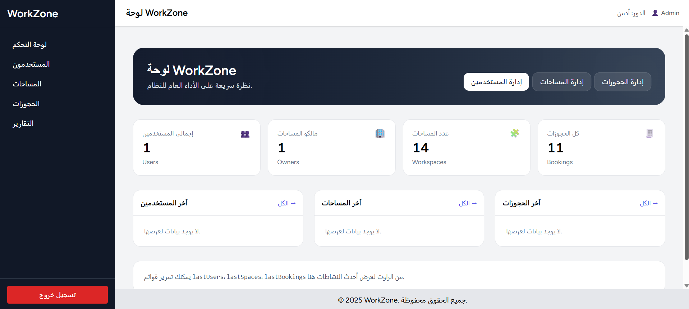
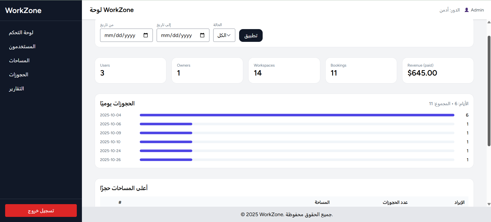
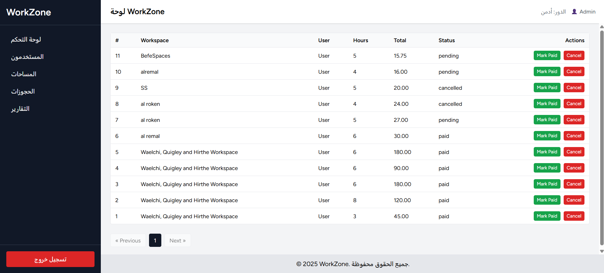

# WorkZone – Coworking Space Booking System  
**Laravel • Inertia.js • Vue**

WorkZone is a **multi-role coworking space booking platform** built with **Laravel**, **Inertia.js**, and **Vue**.  
It is designed with a **SaaS-ready architecture** and supports **Admin**, **Owner**, and **User** dashboards.

---

## ✨ Key Features
- **Authentication & Role-Based Access Control**
  - Admin / Owner / User
- **Workspaces Management**
  - create & update workspaces
  - availability & pricing
- **Booking System**
  - booking requests
  - booking status (pending / approved / rejected / cancelled)
  - user booking history
- **Owner Dashboard**
  - manage workspaces
  - manage bookings
  - basic insights
- **Admin Dashboard**
  - manage users & owners
  - manage workspaces
  - system moderation
- **Responsive UI**
  - TailwindCSS + Vue

---

## 🖼️ Screenshots

### Admin Dashboard


### Owner Dashboard


### Bookings Management


---

## 🧱 Tech Stack
- **Backend:** Laravel (PHP)
- **Frontend:** Inertia.js + Vue
- **Styling:** TailwindCSS
- **Database:** MySQL
- **Build Tool:** Vite

---

## 🗂️ Project Structure (High Level)
- `app/` — application logic
- `routes/` — web routes
- `resources/js/` — Vue & Inertia pages/components
- `database/` — migrations & seeders

---

## 🚀 Getting Started (Local Setup)
**Requirements:** PHP, Composer, Node.js, MySQL

```bash
git clone https://github.com/mohammedswesy/workzone-booking-system.git
cd workzone-booking-system

composer install
cp .env.example .env
php artisan key:generate

# configure your database in .env
php artisan migrate --seed

npm install
npm run dev

php artisan serve
